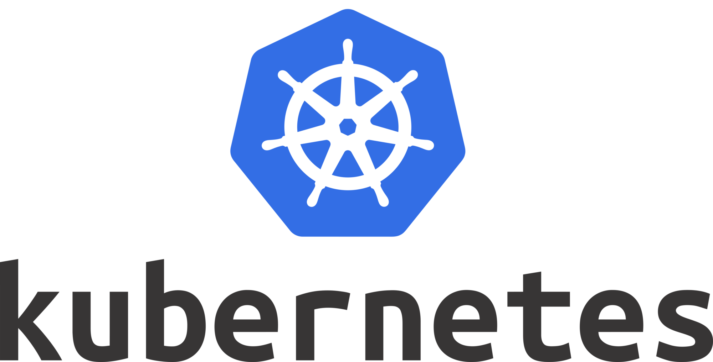

# Bernstein

## Overview

The Bernstein project is an introduction to Kubernetes complex deployments.
It is constitued of:
- 2 databases (Redis and Postgres)
- 3 services (Poll, Worker and Result)
- 1 Load Balancer (Traefik)
- 1 Monitoring Tool (Cadvisor)

## How to run the project

```bash
> minikube start --nodes 2
> sudo minikube tunnel
> sudo ./bernstein.sh
```

# Go to :
> http://poll.dop.io:30021
> http://result.dop.io:30021
> http://localhost:30042
```

## COLLABORATION

- [Valentin R](https://github.com/ValentinRgt)
- [Alexandre T](https://github.com/PikPakPik)